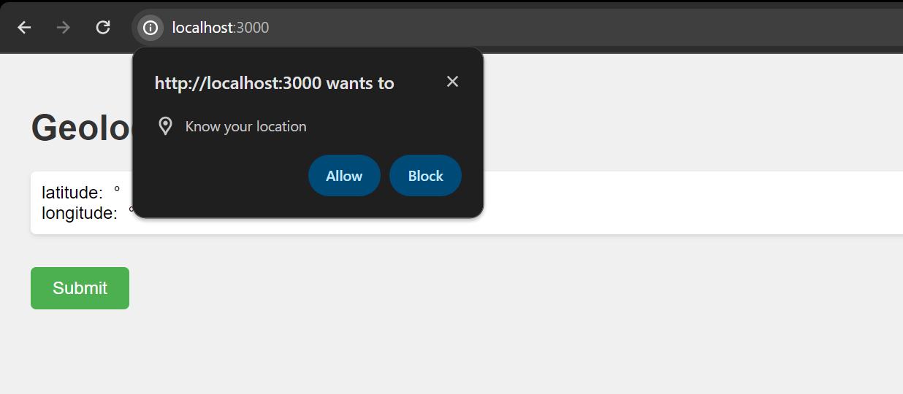
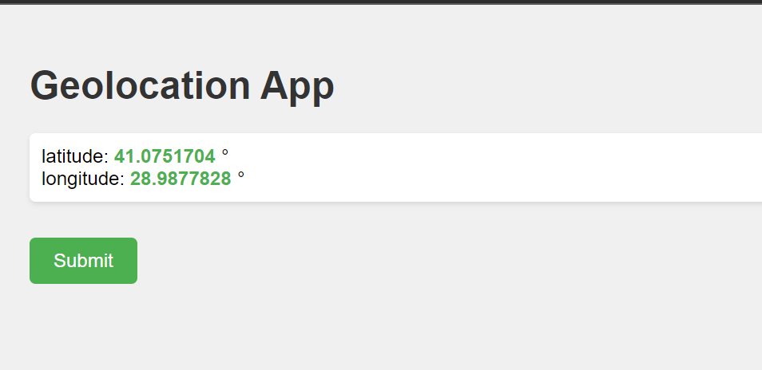
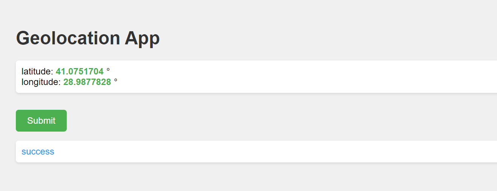
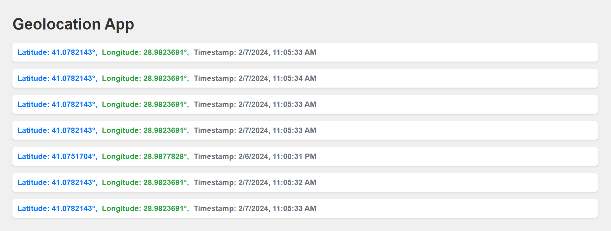

# Geolocation App

This is a simple web application that allows users to capture their geolocation data and submit it to a server for
storage. It consists of an HTML page that retrieves the user's latitude and longitude using the Geolocation API and
sends the data to a server via a POST request. The server, built with Node.js and Express.js, stores the received data
in a database.

## Features

- Captures user's geolocation data (latitude and longitude).
- Sends geolocation data to a server for storage.
- Stores geolocation data in a database.
- Allows users to see the status of their data submission.

## Installation

1. Clone this repository to your local machine.
2. Navigate to the project directory.
3. Install dependencies by running:

```
npm install
```

4. Start the server by running

```
node index.js
```

5. Open the `index.html` file in your web browser to use the application.

## Technologies Used

- HTML/CSS: For the front-end user interface.
- JavaScript: For client-side and server-side scripting.
- Geolocation API: For capturing the user's geolocation data.
- Node.js: For server-side development.
- Express.js: Web framework for handling HTTP requests and routing.
- NeDB: Embedded database used for storing geolocation data.

## Usage

1. Open the `index.html` file in your web browser.
2. Click the "Allow" button when prompted to allow the application to access your geolocation data.
3. The latitude and longitude will be displayed on the page.
4. Click the "Submit" button to send the data to the server.
5. The status of the submission will be displayed below the button.

## Screenshots 




